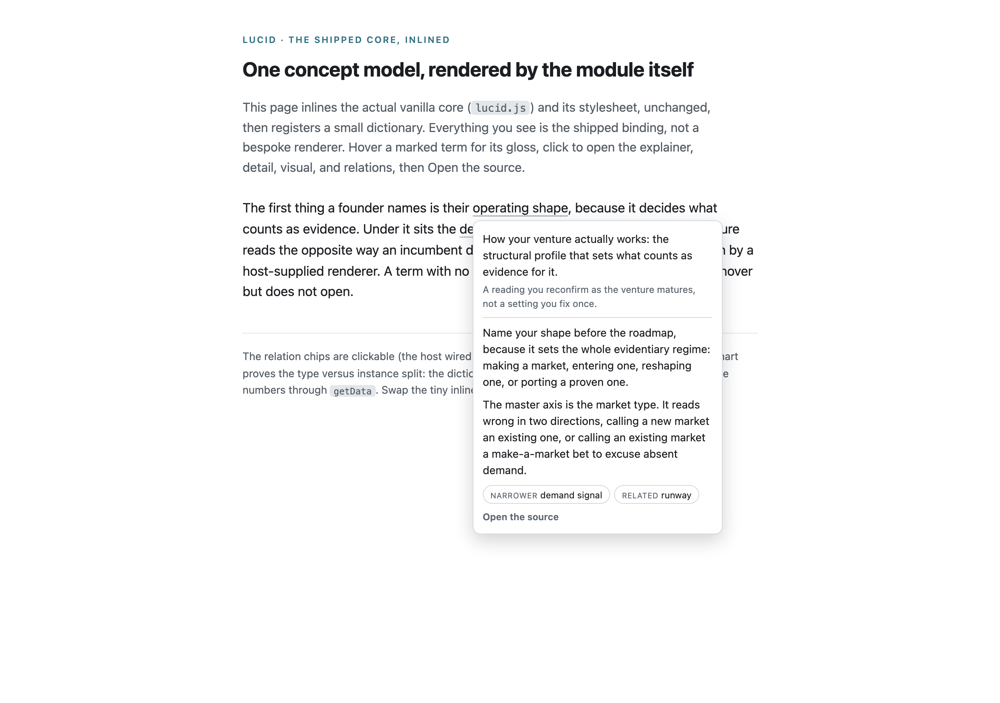

# LUCID

<picture>
  <source media="(prefers-color-scheme: dark)" srcset="assets/lucid-render-dark.png">
  
</picture>

LUCID is reader-sovereign progressive disclosure. Mark a term once, and a reader can open it at three depths: a one-line gloss for the reader who only needs to follow, a focused explainer for the one who needs to use it, and the detail with a path to source for the one who has come to check it. The deepest rung reaches from the compressed claim back to its basis, so the reader can see the compression is faithful, and it leaves the judgment with the reader. It is meant for dense text, dashboards, documentation, and standards-oriented sites, the same places TEMPER is at home, and it composes with TEMPER for its look. No build step is required to use it: the framework-agnostic core is one small ES module and one CSS file, with a React binding alongside for React apps. The package name is `lucid-reader`; it is planned for npm but not yet published.

LUCID stands for Layered Understanding, Calibrated In Disclosure, and the name is meant literally. The word lucid is what the tool produces, a claim you can see to the bottom of, from the Latin for light. The backronym names the mechanism: understanding delivered in layers, calibrated to the reader in how much it discloses and when.

## The idea

A reader is not a fixed type to sort. The general reader who keeps engaging becomes the practitioner, and the practitioner who keeps going becomes the researcher, so the three depths are three stations one reader can walk, in order, if they choose. To reach the last is exactly to arrive where you can see what the claim rests on. No depth is a rank. A reader goes further into one concept, never higher than another, so the gloss is the whole read at gloss precision, not a lesser truth.

The mechanics under this are not new, and LUCID says so plainly. That complexity can be moved but not deleted is Tesler's law. That you reveal it in stages is Nielsen's progressive disclosure. That the reader pulls detail on their own initiative is Shneiderman's details on demand. Routing by what the reader is trying to do is the discipline of Diataxis. Defining a term once and reusing it is ordinary single-source practice, and linking a claim to its source is common in any careful interface. What LUCID adds is not a new mechanism but the assembly: the ascent walked as one graduated line rather than sorted audiences, one concept defined once and read everywhere, and the deepest rung always a reachable path to the basis, with the verdict left to the reader.

## Contents

- `lucid.css`: the mark and the three-depth panel. Written against TEMPER's semantic tokens with a fallback for each, so it is theme-aware where TEMPER is present and works standalone where it is not.
- `lucid.js`: the framework-agnostic core. A zero-dependency ES module that registers a `<lucid-term>` custom element and opens the three depths from a supplied dictionary. Works on any static page.
- `schema.json`: the concept dictionary shape, the data contract a site fills in.
- `react/index.js`: the React binding. `LucidProvider`, `Lucid`, and `useConcept`, using the same classes as the core, no build step.
- `demo.html`: a self-contained preview.
- `verify.mjs`: checks a dictionary against the schema's rules.
- `LUCID - the standard.md`: the standard, and how it grounds in Dimensional Frame Language. This module implements its mark, a term opened at three depths; the standard reaches further, to the flow, the trail, and the four spheres, which the module does not yet render.

## Quickstart

### Path 1: any site, no framework

Copy `lucid.css` and `lucid.js` into your project. Style, register a dictionary, and mark terms.

```html
<link rel="stylesheet" href="/lucid.css">

<p>Name your <lucid-term>operating shape</lucid-term> before the roadmap.</p>

<script type="module">
  import { registerConcepts } from '/lucid.js'
  registerConcepts({
    'operating shape': {
      gloss: 'How your venture actually works, and what counts as evidence for it.',
      explainer: 'Name it before the roadmap; it sets the whole evidentiary regime.',
      sources: [{ label: 'Blank, the four market types', note: 'the master axis that sets what you inherit' }]
    }
  })
</script>
```

Or declare the dictionary inline and skip the JavaScript config entirely:

```html
<script type="application/json" data-lucid-registry>
  { "operating shape": { "gloss": "How your venture actually works." } }
</script>
```

### Path 2: React

```tsx
import 'lucid-reader/lucid.css'
import { LucidProvider, Lucid } from 'lucid-reader/react'
import { REGISTRY } from './concepts' // your dictionary, in the schema.json shape

export default function App() {
  return (
    <LucidProvider registry={REGISTRY}>
      <p>Name your <Lucid term="operating shape">operating shape</Lucid> before the roadmap.</p>
    </LucidProvider>
  )
}
```

### Composing with TEMPER

`lucid.css` reads TEMPER's semantic tokens (`--color-bg-elevated`, `--color-border`, `--color-text-primary`, `--color-accent`, and the positive role used by the source rung). Set a TEMPER mode on the root and LUCID follows it. Where TEMPER is absent, the fallbacks render a clean neutral panel.

## The dictionary

A dictionary maps a term, lowercased, to a concept: a required `gloss`, and optionally an `explainer`, a `detail` for the fuller third depth, a `domain` frame surfaced at the gloss depth, `sources` (each a `label` with an optional `href` and `note`), `relations` to other concepts (`broader`, `narrower`, `related`, a separate axis from depth), and a declarative `visual` binding. The full shape is `schema.json`. A term with only a gloss opens nothing; it glosses on hover and stays flat.

The visual and the relations are rendered by hooks you pass to the provider, so the module stays dependency-free. Pass `renderVisual` to draw a concept's visual (the module hands it the spec, you bring the visualization runtime, for example Vega-Lite), `getData` to supply the instance data at render (the dictionary holds the spec, your app holds the data), and `onSelect` to navigate when a reader picks a related concept. In the vanilla core the same hooks are set once with `configure({ renderVisual, getData, onSelect })`. All three are optional; without them a concept's text depths, source, and relation labels still render.

Check a dictionary before shipping:

```
node verify.mjs path/to/registry.json
```

## Accessibility

The mark is keyboard-reachable, toggles on Enter and Space, and shows a focus ring. The panel closes on Escape and on an outside click. The gloss is always available as a native tooltip, so depth one needs no interaction at all.

## Part of the Polymathie family

LUCID is one of the [Polymathie](https://github.com/Polymathie-Studio) primitives: small, dependency-free pieces for building websites, dashboards, and tools, where each protects one posture that fast, AI-assisted building tends to drop. Its siblings are [TEMPER](https://github.com/Polymathie-Studio/temper) (legibility and design tokens) and [HASP](https://github.com/Polymathie-Studio/hasp) (bring-your-own-key privacy), with more of the invisible-correctness layer in progress. Adopt one and the others compose with it.

## License

The standard document (`LUCID - the standard.md`) is licensed under the Creative Commons Attribution 4.0 International License; see `LICENSE-SPEC`. The code and other software artifacts are licensed under the Apache License 2.0; see `LICENSE` and `NOTICE`.
